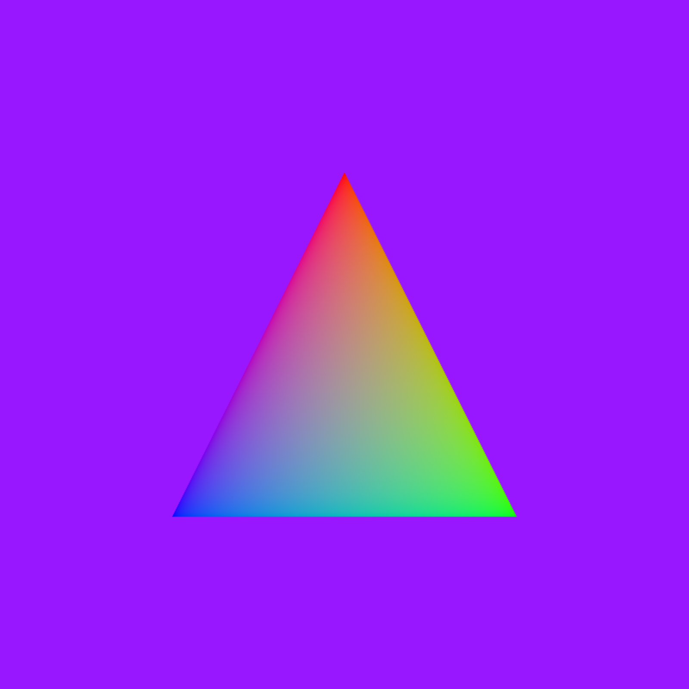
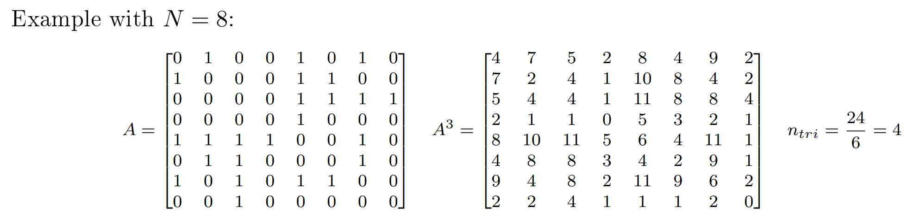
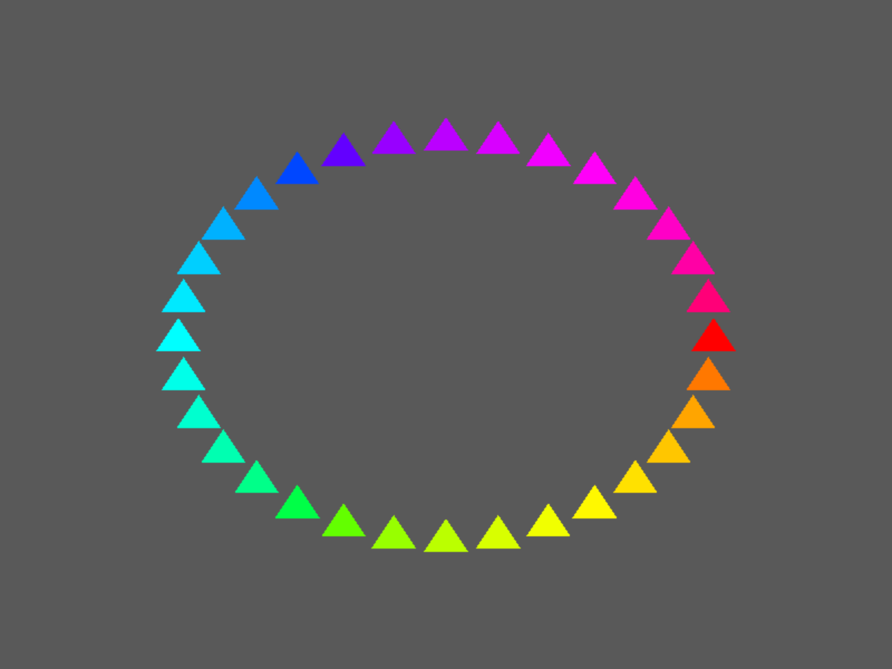
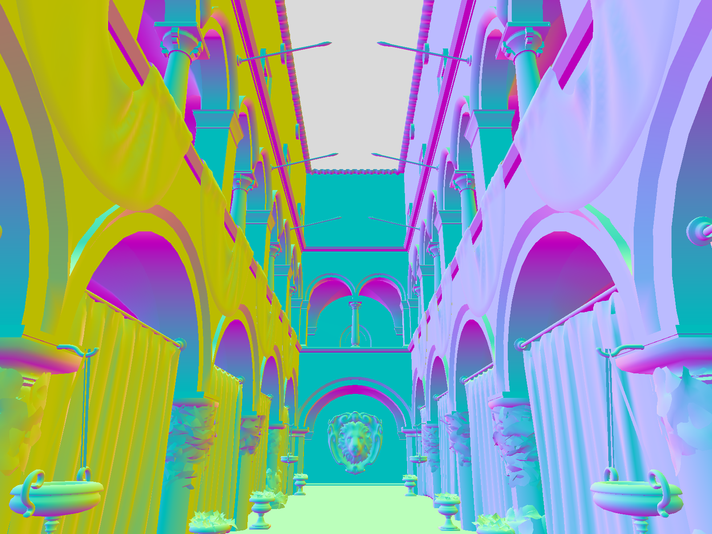

# Vulkan Journey: Exploring Modern Graphics


**Warning:** This is an experimental sandbox for learning and exploring modern Vulkan. It is not intended for production use.

## Project Goals

The objective is to master **Vulkan 1.3+** and modern rendering techniques. 
This project is heavily inspired by Sebastian Aaltonen's blog post ["No Graphics API"](https://www.sebastianaaltonen.com/blog/no-graphics-api), focusing on a more "compute-like" interface for the GPU, reducing CPU overhead and abstraction layers.

## Samples & Progress

### 1. Hello Triangle


### 2. Compute Shader (Graph Analytics)
Beyond rendering: this sample computes the total number of triangles in a undirected graph using its adjacency matrix $A$. 

output:
```
./2_compute 
N = 8
Trace(A^3) = 24
Number of triangles = 4
```

### 3. Textures


### 4. Indirect Triangles


### 5. 3D Scene (Sponza)


## Key Technologies
- **Vulkan 1.3 Core**
- **Descriptor Buffers** (`VK_EXT_descriptor_buffer`): Modern way to bind resources without Descriptor Sets.
- **Dynamic State** (`VK_EXT_extended_dynamic_state_3`): To reduce Pipeline State Object (PSO) bloat.
- **GPU-Driven Rendering** (Planned/Current focus).

## Prerequisites

Before building, ensure you have:
- **Vulkan SDK 1.3+**
- A GPU with drivers supporting `Descriptor Buffers`
- **CMake** (3.25+)
- **C++20**
- **Slang** for compiling slang shader into SPIR-V

## Building the project

### Windows (using Ninja)
```sh
cmake -G Ninja -B build
cmake --build build
```

### Linux (Wayland)
```sh
cmake -B build -DCMAKE_BUILD_TYPE=Debug -DGLFW_BUILD_WAYLAND=ON -DGLFW_BUILD_X11=OFF
cmake --build build
```

### Linux (X11)
```sh
cmake -B build -DCMAKE_BUILD_TYPE=Debug -DGLFW_BUILD_WAYLAND=OFF -DGLFW_BUILD_X11=ON
cmake --build build
```

## References & Inspiration
- ["No Graphics API"](https://www.sebastianaaltonen.com/blog/no-graphics-api)
