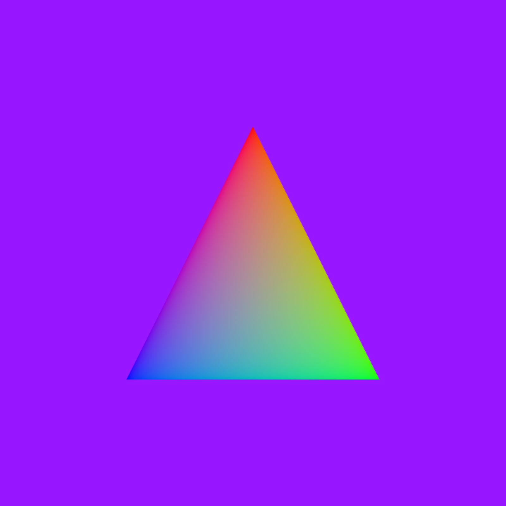
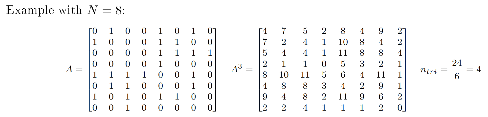
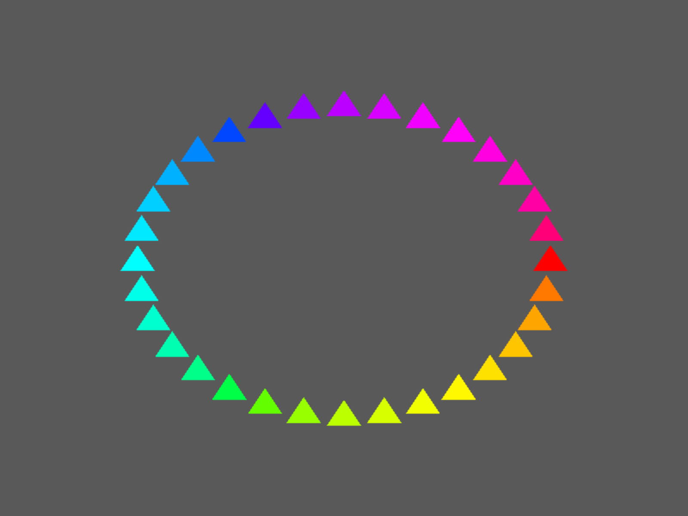
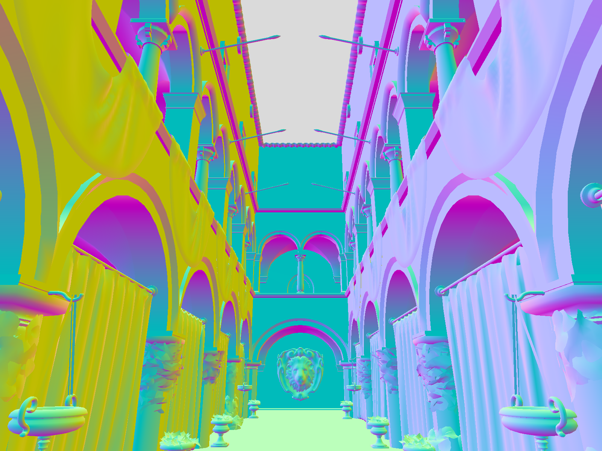

# Vulkan Journey: Exploring Modern Graphics


**Warning:** This is an experimental sandbox for learning and exploring modern Vulkan. It is not intended for production use.

## Project Goals

The objective is to master **Vulkan 1.3+** and modern rendering techniques. 
This project is heavily inspired by Sebastian Aaltonen's blog post ["No Graphics API"](https://www.sebastianaaltonen.com/blog/no-graphics-api), focusing on a more "compute-like" interface for the GPU, reducing CPU overhead and abstraction layers.

## Samples

### 1. Hello Triangle


### 2. Compute Shader (Graph Analytics)
Beyond rendering: this sample computes the total number of triangles in an undirected graph using its adjacency matrix $A$. 

output:
```
./2_compute 
N = 8
Trace(A^3) = 24
Number of triangles = 4
```

### 3. Textures


### 4. Indirect Triangles


### 5. 3D Scene (Sponza)


## Key Technologies
- **Vulkan 1.3 Core**
- **Descriptor Buffers** (`VK_EXT_descriptor_buffer`): Modern way to bind resources without Descriptor Sets.
- **Dynamic State** (`VK_EXT_extended_dynamic_state_3`): To reduce Pipeline State Object (PSO) bloat.
- **Dynamic Rendering**: No render passes or framebuffers.
- **Synchronization2** and **Timeline Semaphores**: A single timeline semaphore tracks frames in flight.
- **Buffer Device Address**: Shaders receive raw GPU pointers through push constants.
- **GPU-Driven Rendering** (current focus): Indirect draws with GPU-side draw count (`vkCmdDrawIndexedIndirectCount`).

### Dependencies (bundled in `external/`)
- [GLFW 3.4](https://www.glfw.org/)
- [volk](https://github.com/zeux/volk)
- [Vulkan Memory Allocator 3.3.0](https://github.com/GPUOpen-LibrariesAndSDKs/VulkanMemoryAllocator)
- [GLM](https://github.com/g-truc/glm)
- ctl: a small custom template library (allocators, containers, `defer`)

## Prerequisites

Before building, ensure you have:
- **Vulkan SDK 1.3+**
- A GPU with drivers supporting `Descriptor Buffers`
- **CMake** (3.25+)
- **C++20**
- **Slang** (`slangc` in your `PATH`) for compiling Slang shaders into SPIR-V

## Building the project

### Windows (using Ninja)
```sh
cmake -G Ninja -B build
cmake --build build
```

### Linux (Wayland)
```sh
cmake -B build -DCMAKE_BUILD_TYPE=Debug -DGLFW_BUILD_WAYLAND=ON -DGLFW_BUILD_X11=OFF
cmake --build build
```

### Linux (X11)
```sh
cmake -B build -DCMAKE_BUILD_TYPE=Debug -DGLFW_BUILD_WAYLAND=OFF -DGLFW_BUILD_X11=ON
cmake --build build
```

> **Note (Windows):** C++ exceptions and RTTI are disabled (`/EHsc` and `/GR` are stripped from the compiler flags).

### AddressSanitizer
Add `-DUSE_ASAN=ON` to the configure command to build the samples with ASan.

## Running the samples

Shaders, textures and assets are loaded with relative paths, so run the executables from the build output directory:
```sh
cd build/examples
./1_triangle
```

## Status
This project is feature-complete as a learning sandbox and is no longer actively developed. My ongoing Vulkan work continues in [wvk](https://github.com/Spad0n/wvk), a reusable Vulkan 1.3 library (mesh shaders, Dear ImGui backend).

## References & Inspiration
- ["No Graphics API"](https://www.sebastianaaltonen.com/blog/no-graphics-api)
